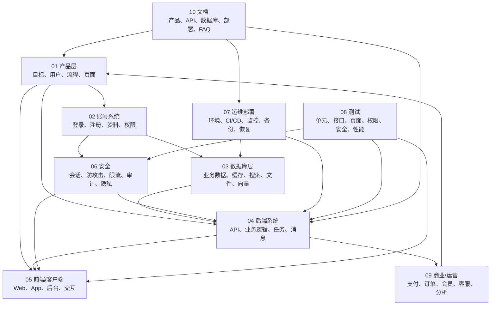

# 10 Module System Diagram

完整软件不是单个登录页、数据库或前端页面，而是 10 个模块互相约束和协作。

```mermaid
flowchart TB
  product["01 产品层<br/>目标、用户、流程、页面"]
  account["02 账号系统<br/>登录、注册、资料、权限"]
  database["03 数据库层<br/>业务数据、缓存、搜索、文件、向量"]
  backend["04 后端系统<br/>API、业务逻辑、任务、消息"]
  frontend["05 前端/客户端<br/>Web、App、后台、交互"]
  security["06 安全<br/>会话、防攻击、限流、审计、隐私"]
  ops["07 运维部署<br/>环境、CI/CD、监控、备份、恢复"]
  testing["08 测试<br/>单元、接口、页面、权限、安全、性能"]
  business["09 商业/运营<br/>支付、订单、会员、客服、分析"]
  docs["10 文档<br/>产品、API、数据库、部署、FAQ"]

  product --> account
  product --> frontend
  product --> backend
  account --> database
  account --> security
  database --> backend
  backend --> frontend
  backend --> business
  security --> backend
  security --> frontend
  ops --> backend
  ops --> database
  testing --> frontend
  testing --> backend
  testing --> security
  business --> product
  docs --> product
  docs --> backend
  docs --> ops
```

## Reading Notes

- 产品层决定其他模块的方向。
- 账号系统和数据库通常是最早需要落地的基础。
- 安全、测试、运维和文档不是附加项，它们横跨所有模块。
- 商业/运营功能会反过来影响产品、账号、数据库和后台。

