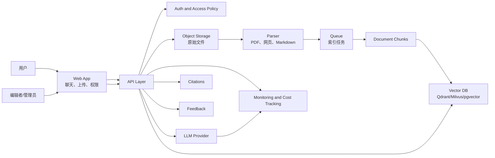

# AI Knowledge Base Reference Architecture

适合：企业知识库、文档问答、客服助手、研发文档检索。

## Key Decisions

| Decision | Default |
| --- | --- |
| Source storage | Object storage |
| Chunk storage | PostgreSQL or document table |
| Vector search | Qdrant, Milvus, or pgvector |
| Ingestion | Async queue with retry |
| Permissions | Filter before retrieval and before answer generation |
| Quality | Evaluation set for retrieval and answers |

## Production Notes

- 检索必须遵守文档权限。
- 答案要展示引用来源。
- 上传文件要限制大小、类型和权限。
- 模型成本、延迟和失败率要监控。

