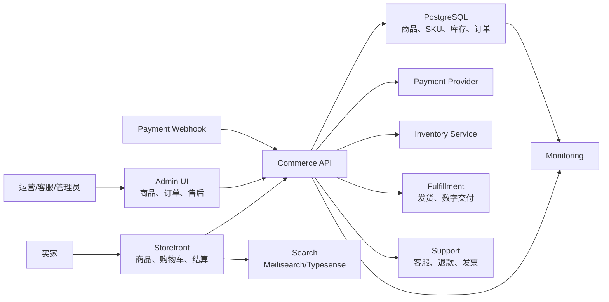

# Ecommerce Reference Architecture

适合：商品销售、课程、数字产品、预约服务。

## Key Decisions

| Decision | Default |
| --- | --- |
| Product model | Product + variant/SKU |
| Inventory | Server-side stock reservation |
| Payment | Provider checkout + signed webhook |
| Search | Dedicated search service for catalog |
| Admin | Separate protected admin dashboard |
| Refunds | State machine with audit log |

## Production Notes

- 下单、支付和库存扣减要幂等。
- 买家只能查看自己的订单。
- 后台危险操作要二次确认和审计。
- 售后、退款、发票流程要写进用户文档。

