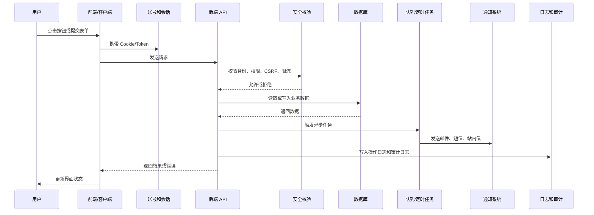

# Full Stack Request Flow

这个图描述一次典型用户操作如何穿过完整软件。

```mermaid
sequenceDiagram
  participant User as 用户
  participant Client as 前端/客户端
  participant Auth as 账号和会话
  participant API as 后端 API
  participant Security as 安全校验
  participant DB as 数据库
  participant Queue as 队列/定时任务
  participant Notify as 通知系统
  participant Logs as 日志和审计

  User->>Client: 点击按钮或提交表单
  Client->>Auth: 携带 Cookie/Token
  Client->>API: 发送请求
  API->>Security: 校验身份、权限、CSRF、限流
  Security-->>API: 允许或拒绝
  API->>DB: 读取或写入业务数据
  DB-->>API: 返回数据
  API->>Queue: 触发异步任务
  Queue->>Notify: 发送邮件、短信、站内信
  API->>Logs: 写入操作日志和审计日志
  API-->>Client: 返回结果或错误
  Client-->>User: 更新界面状态
```

## Checklist

- 每个写操作都应该有身份和权限校验。
- 涉及状态变化时，后端要写审计日志。
- 耗时任务应该进入队列，不阻塞用户请求。
- 用户界面要展示成功、失败、加载和无权限状态。

