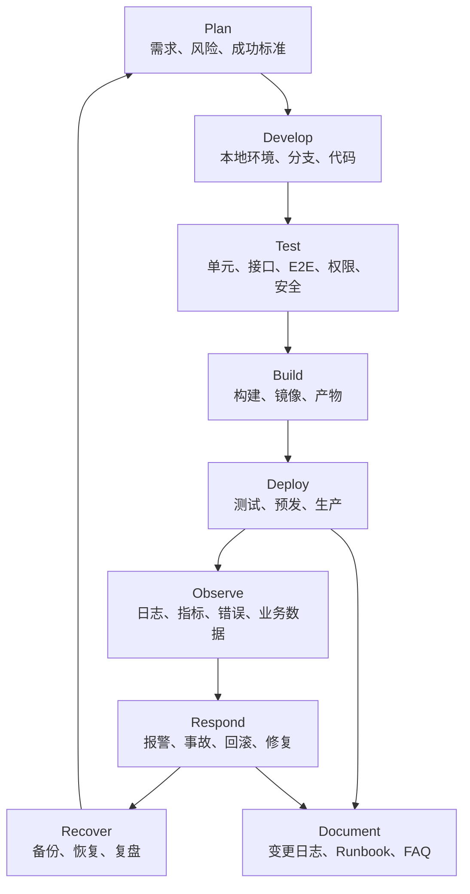

# Operations Lifecycle

从本地开发到生产运维的闭环。

```mermaid
flowchart TB
  plan["Plan<br/>需求、风险、成功标准"]
  dev["Develop<br/>本地环境、分支、代码"]
  test["Test<br/>单元、接口、E2E、权限、安全"]
  build["Build<br/>构建、镜像、产物"]
  deploy["Deploy<br/>测试、预发、生产"]
  observe["Observe<br/>日志、指标、错误、业务数据"]
  respond["Respond<br/>报警、事故、回滚、修复"]
  recover["Recover<br/>备份、恢复、复盘"]
  docs["Document<br/>变更日志、Runbook、FAQ"]

  plan --> dev
  dev --> test
  test --> build
  build --> deploy
  deploy --> observe
  observe --> respond
  respond --> recover
  recover --> plan
  deploy --> docs
  respond --> docs
```

## Reading Notes

- 运维不是部署那一刻才开始，而是从需求和测试开始。
- 事故处理结束后必须回到文档和测试，防止同类问题再次出现。
- 每次发布都应该能回答：如何验证、如何回滚、如何确认用户影响。

