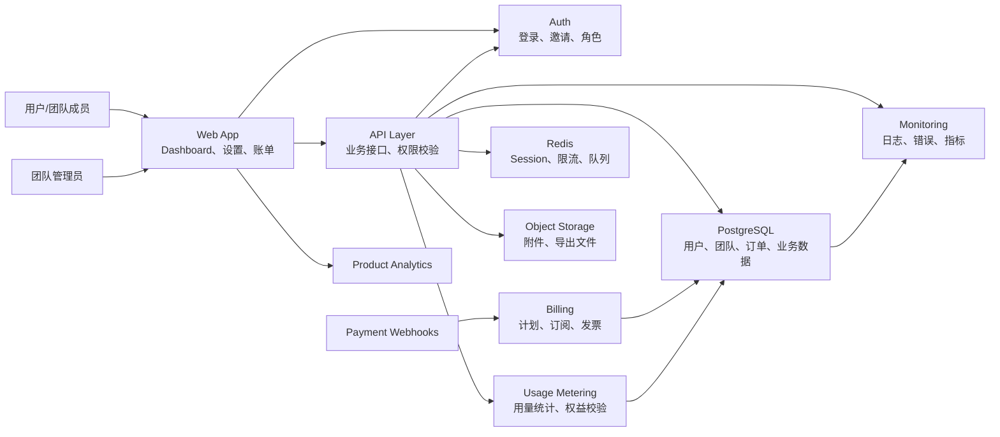

# SaaS Reference Architecture

适合：订阅工具、B2B 产品、AI 工具、开发者工具。

## Key Decisions

| Decision | Default |
| --- | --- |
| Main database | PostgreSQL |
| Session/cache | Redis or managed equivalent |
| Billing | Stripe or local payment provider |
| Analytics | PostHog or similar |
| Error monitoring | Sentry or OpenTelemetry-based stack |
| Deployment | Vercel/Render/Fly.io or Docker/Kubernetes |

## Production Notes

- 支付 webhook 必须服务端验签。
- 用量限制必须服务端校验。
- 团队数据必须按租户隔离。
- 账单、发票、退款和取消订阅要有文档。

